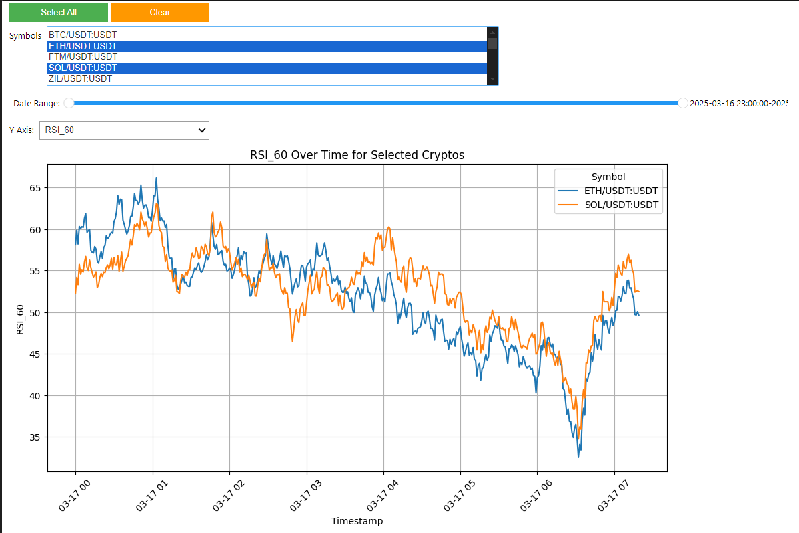

# ccxt-dashboard

Jupyter Notebook dashboard for multiple cryptocurrencies indicators visualization

## Features

- Multi select symbols (BTC, ETH, ...)
- X axis time slider 
- Y axis variable selecter
- OHLC
- Indicators (different periods 3, 10, 20, 60, 120):
    - VAR
    - STDDEV
    - PPO
    - ROC
    - MOM
    - NATR
    - RSI
    - CCI
    - EMA
    - DX
    - ADX
    - PDI
    - MDI
 
## Usage

 Easiest way to use it is in VSCode.
 
 1. Control + shift + p > Create virtual environment
 2. Play Jupyter Notebook
 3. Install Ipykernel
 4. Uncomment first line (install requirements)
 5. Play Jupyter Notebook
